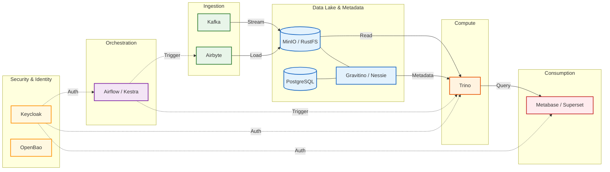

# Terraform Modules for Data Platform


Production-ready Terraform modules for deploying a modern data platform on Kubernetes. Designed for **scalability**, **security**, and **developer experience**. Compatible with local clusters (Minikube, K3s, Docker Desktop) and cloud providers (EKS, GKE, AKS).

---

## 🏗️ Architecture

The platform follows a modular, decoupled architecture centered around a Data Lake and modern orchestration:



## 📦 Modules

| Category | Module | Description | Key Features |
|----------|--------|-------------|--------------|
| **Core** | [**Postgres**](modules/postgres/) | CloudNativePG Cluster | HA, Auto-failover, RW/RO separation |
| | [**MinIO**](modules/minio/) | Object Storage | Distributed S3, Operator-managed, Tenants |
| | [**RustFS**](modules/rustfs/) | Lightweight S3 | Rust-based, High performance, Low footprint |
| | [**OpenBao**](modules/openbao/) | Secrets Management | Vault fork, Standalone/HA, UI |
| | [**Keycloak**](modules/keycloak/) | Identity & Access Mgt | SSO, User Federation, OIDC/SAML |
| **Ingestion** | [**Airbyte**](modules/airbyte/) | ELT Platform | Connector library, UI, API |
| | [**Kafka**](modules/kafka/) | Event Streaming | Strimzi (KRaft), Schema Registry, UI |
| **Orchestration** | [**Airflow**](modules/airflow/) | Workflow Engine | Git-Sync, Celery/K8s Executors, Flower |
| | [**Kestra**](modules/kestra/) | Declarative Workflow | YAML pipelines, Low-code, High throughput |
| **Catalog** | [**Gravitino**](modules/gravitino/) | Metadata Lake | Multi-cloud, Auto-schema discovery |
| | [**Nessie**](modules/nessie/) | Data Git | Git-like versioning for Iceberg tables |
| | [**Lakekeeper**](modules/lakekeeper/) | Iceberg REST Catalog | Rust-native, S3/GCS/Azure support |
| **Analytics** | [**Trino**](modules/trino/) | Distributed SQL | Federated queries, Iceberg connector |
| | [**Metabase**](modules/metabase/) | BI Tool | No-code dashboards, Embeddable |
| | [**Superset**](modules/superset/) | Data Exploration | SQL Lab, Rich visualizations |

## 🚀 Quick Start

### Prerequisites
- **Terraform** ≥ 1.0
- **Kubernetes** 1.25+ (Minikube/K3s/Docker Desktop)
- **Helm** 3.x
- **kubectl**

### 1. Setup Namespace & Operators
Use the provided standardized scripts to prepare your cluster:

```bash
# Create namespaces
curl -sSL "https://raw.githubusercontent.com/daun-gatal/terraform-modules/main/scripts/create-namespaces.sh" | bash -s -- database storage airflow

# Install Operators (CNPG, MinIO, Strimzi, etc.)
curl -sSL "https://raw.githubusercontent.com/daun-gatal/terraform-modules/main/scripts/manage-operators.sh" | bash
```

### 2. Run an Example
We provide full, testable examples in `examples/`. The best place to start is the **Minimal Setup**:

```bash
cd examples/minimal-setup
cp terraform.tfvars.example terraform.tfvars
# Edit terraform.tfvars with your secrets
terraform init
terraform apply
```

### 3. Use as a Module
To use a specific module in your own project:

```hcl
module "postgres" {
  source = "git::https://github.com/daun-gatal/terraform-modules.git//modules/postgres?ref=main"
  
  namespace   = "database"
  db_password = var.db_password # Mark as sensitive!
}
```

## 🛠️ Development

### Local Validation
Before submitting a PR, ensure your code passes standard checks:

```bash
# 1. Format code
terraform fmt -recursive

# 2. Validate modules
terraform validate

# 3. Run TFLint (optional but recommended)
tflint --init
tflint -recursive
```

### Documentation
We use `terraform-docs` to keep `README.md` files in sync. The CI/CD pipeline will fail if documentation is out of date.

## 🤖 CI/CD Pipelines

This repository uses **GitHub Actions** with **Self-Hosted Runners** for continuous integration:

- **Lint & Validate**: Checks Terraform formatting, validation, and TFLint rules.
- **Documentation**: Verifies `README.md` is up-to-date with `variables.tf`.
- **Security**: Scans for IaC vulnerabilities using **Trivy**.
- **Scripts**: Validates shell scripts with `shellcheck`.

## 🤝 Contributing

Contributions are welcome! Please follow these steps:
1.  Fork the repository.
2.  Create a feature branch.
3.  Commit your changes (signed commits preferred).
4.  Open a Pull Request.