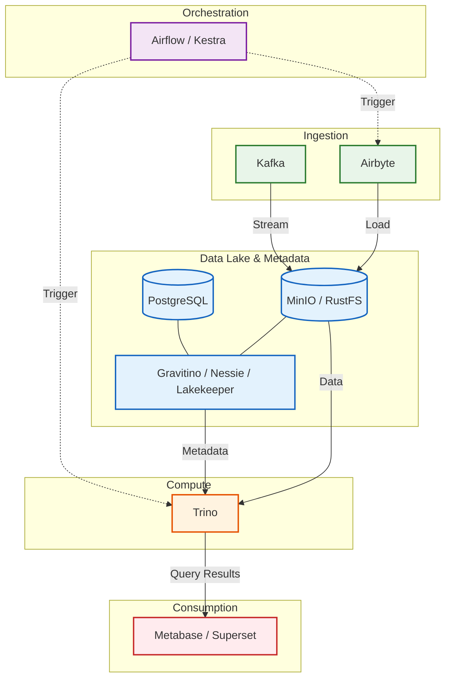

# Terraform Modules for Data Platform

Production-ready Terraform modules for deploying a modern data platform on Kubernetes. compatible with Minikube, K3s, and Cloud providers.

## 🏗️ Architecture



## 📦 Modules

| Category | Module | Description | Key Features |
|----------|--------|-------------|--------------|
| **Core** | [**Postgres**](modules/postgres/) | CloudNativePG Cluster | HA, Auto-failover, RW/RO separation |
| | [**MinIO**](modules/minio/) | Object Storage | Distributed S3, Operator-managed |
| | [**RustFS**](modules/rustfs/) | Lightweight S3 | Rust-based, High performance, Low footprint |
| | [**OpenBao**](modules/openbao/) | Secrets Management | Vault fork, Standalone/HA, UI |
| **Ingestion** | [**Airbyte**](modules/airbyte/) | ELT Platform | Connector library, UI, API |
| | [**Kafka**](modules/kafka/) | Event Streaming | Strimzi (KRaft), Schema Registry, UI |
| **Orchestration** | [**Airflow**](modules/airflow/) | Workflow Engine | Git-Sync, Celery/K8s Executors, Flower |
| | [**Kestra**](modules/kestra/) | Declarative Workflow | YAML pipelines, Low-code, High throughput |
| **Catalog** | [**Gravitino**](modules/gravitino/) | Metadata Lake | Multi-cloud, Auto-schema discovery |
| | [**Nessie**](modules/nessie/) | Data Git | Git-like versioning for Iceberg tables |
| | [**Lakekeeper**](modules/lakekeeper/) | Iceberg REST Catalog | Rust-native, S3/GCS/Azure support |
| **Analytics** | [**Trino**](modules/trino/) | Distributed SQL | Federated queries, Iceberg connector |
| | [**Metabase**](modules/metabase/) | BI Tool | No-code dashboards, Embeddable |
| | [**Superset**](modules/superset/) | Data Exploration | SQL Lab, Rich visualizations |

## 🚀 Quick Start

### 1. Setup Namespace & Operators
```bash
# Create namespaces
curl -sSL "https://gitlab.com/daun-gatal/terraform-modules/-/raw/main/scripts/create-namespaces.sh" | bash -s -- database storage airflow

# Install Operators (CNPG, MinIO, Strimzi, etc.)
curl -sSL "https://gitlab.com/daun-gatal/terraform-modules/-/raw/main/scripts/manage-operators.sh" | bash
```

### 2. Deploy Modules
```hcl
module "postgres" {
  source = "git::https://gitlab.com/daun-gatal/terraform-modules.git//modules/postgres?ref=main"
  namespace   = "database"
  db_password = "secure-password"
}
```

See **[examples/](examples/)** for complete working (and interconnected) configurations.

## � Prerequisites
- **Terraform** ≥ 1.0
- **Kubernetes** 1.25+ (Minikube/K3s/EKS/GKE)
- **Helm** 3.x
- **kubectl**

## 🤝 Contributing
Contributions welcome at [GitLab repository](https://gitlab.com/daun-gatal/terraform-modules).