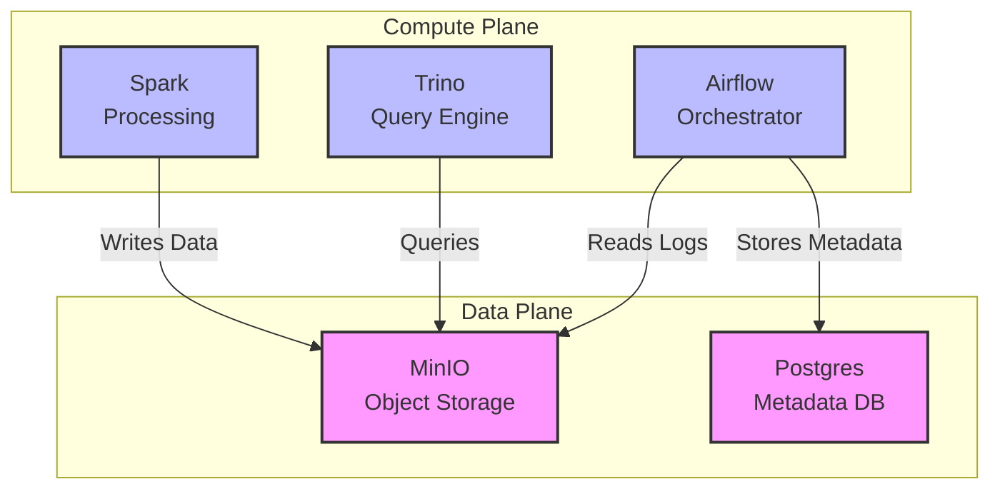

# Architecture & Design Philosophy

The modules in this repository follow strict architectural standards to ensure they are composable, maintainable, and reliable at scale.

## The Problem: Output Bloat & Duplication

In many Terraform codebases, modules often output the same data in multiple formats (e.g., `jdbc_url`, `host`, `port`, `connection_string`), or worse, they duplicate input variables as outputs "just in case". This leads to:

1.  **Ambiguity**: Which output should I use for connection?
2.  **Bloat**: State files become huge.
3.  **Refactoring Nightmares**: Changing an internal implementation breaks consumers relying on ad-hoc outputs.

## The Solution: "Exclusive Config" Pattern

We implemented the **Exclusive Config** pattern. This separates **Identity** (who I am) from **Configuration** (how to talk to me).

### 1. Top-Level Identity
Every module outputs *only* the standard Kubernetes resource identifiers at the top level.

| Output Name | Description | Example |
| :--- | :--- | :--- |
| `release_name` | The Helm release name | `airflow-release` |
| `namespace` | The Kubernetes namespace | `data-ops` |
| `service_name` | The primary K8s Service name | `airflow-webserver` |
| `service_port` | The primary Service port | `8080` |
| `ingress_host` | Public DNS (if applicable) | `airflow.example.com` |

### 2. The `config` Object
Everything else—dependencies, credentials, complex connection strings—lives inside a single `config` output object. This object is marked `sensitive = true` if it contains secrets.

```hcl
output "config" {
  value = {
    # Calculated Internal URL (Convenience)
    internal_url = "http://..."

    # Module-specific attributes
    attributes = {
      root_user = "admin"
      root_pass = "secret"
      # ...
    }
  }
}
```

## Why This Matters

### For Composability
You can write wrapper modules that indiscriminately pass `module.foo.config` to other modules without knowing the schema.

### For Security
By interacting with the `config` object, you are explicitly acknowledging you are handling configuration data, often including secrets.

### For Clean Code
```hcl
# BEFORE (Messy)
host = module.postgres.host
port = module.postgres.port
user = module.postgres.admin_username
pass = module.postgres.admin_password

# AFTER (Clean)
# Identity is clear
host = "${module.postgres.service_name}.${module.postgres.namespace}"
# Config is encapsulated
creds = module.postgres.config.attributes
```

## Module Interaction Diagram


