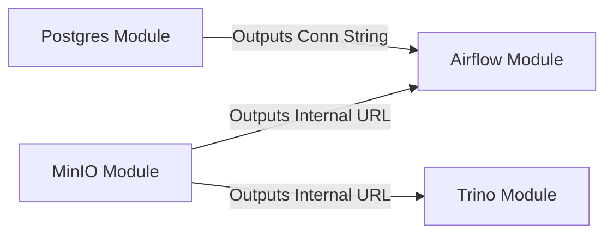

# Module Interaction Guide

This guide explains how to effectively use and compose these modules to build a platform.

## The Standard Interface

Every module in this ecosystem follows a strict Input/Output standard. This predictability allows you to compose complex systems easily.

### 1. Identity Outputs
Top-level outputs always describe "What exist":
*   `service_name`
*   `service_port`
*   `namespace`

### 2. Configuration Object
The `config` output describes "How to use it":
*   `internal_url`: A ready-to-use connection string (e.g., `postgresql://...`)
*   `attributes`: A map of credentials and properties.

## Example: Building a Data Platform

These modules are designed to work together. Here is how a typical Modern Data Stack connects using these standard interfaces:



## Composition Workflow

1.  **Deploy Core Infrastructure**: Start with Storage (MinIO, Postgres).
2.  **Read Outputs**: Use the `config.internal_url` from the core modules.
3.  **Deploy Compute**: Pass those URLs into Airflow or Trino.

```hcl
# 1. Deploy Postgres
module "postgres" {
  source = "..."
}

# 2. Deploy Airflow, using Postgres' standard output
module "airflow" {
  source = "..."
  metadata_db_conn = module.postgres.config.internal_url
}
```
